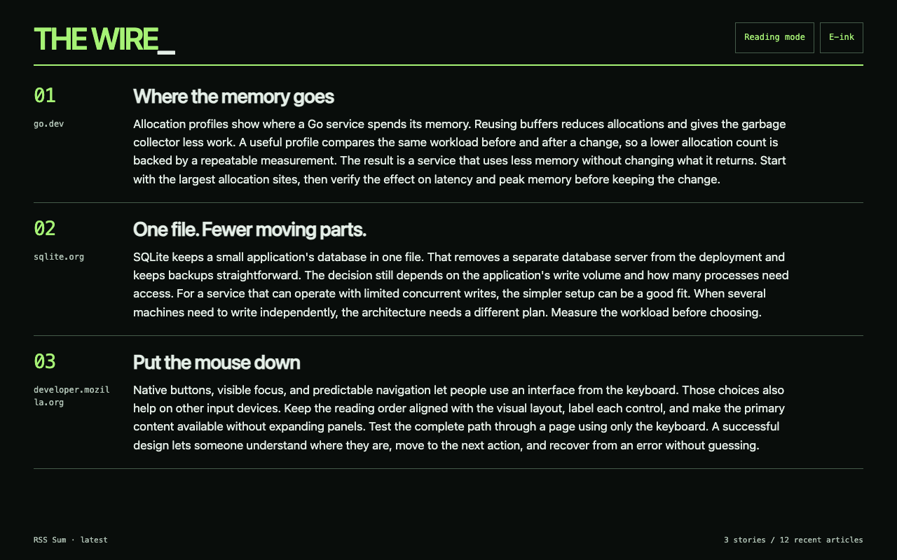
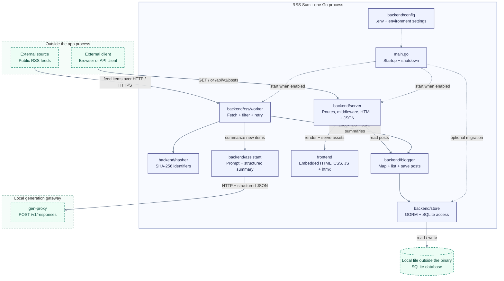
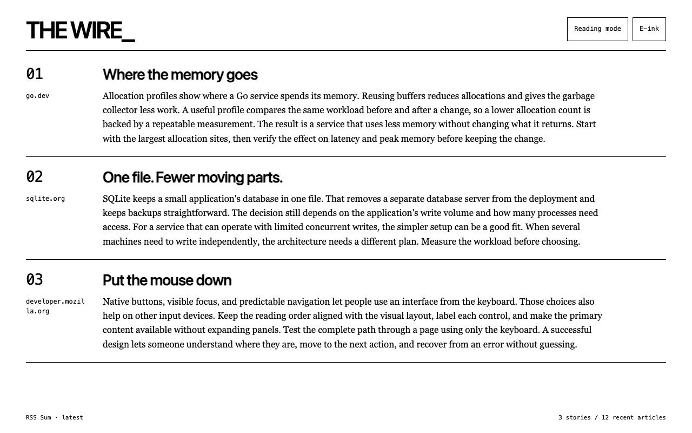

# RSS Sum

[](https://github.com/rjxby/rss-sum/actions/workflows/ci.yaml)
[](LICENSE)

RSS Sum is an AI-assisted feed reader built in Go. It watches RSS feeds, summarizes new articles with an LLM, stores the results in SQLite, and serves a fast HTML interface plus a JSON API.

This project is designed to show practical backend engineering: safe external fetching, gen-proxy integration, SQLite persistence, server-rendered UI, and a small production-style CI setup.



Wall digest with sample stories. See [Wall digest](#wall-digest) for display modes and refresh behavior.

## How it works



Solid purple boxes show app code. Dashed green boxes show components outside the app process. Arrow labels describe requests, data, or package access; dotted arrows show startup wiring. Gen-proxy runs as a separate service and owns integration with the inference backends.

See the [architecture and dependency inventory](docs/architecture.md) for package responsibilities and library usage.

## Highlights

- **AI summaries**: Generates concise summaries through the gen-proxy Responses API.
- **RSS worker**: Polls configured feeds, retries transient failures, and only stores new posts.
- **Safe feed fetching**: Blocks local hosts and private IP addresses, checking redirects and connections too.
- **SQLite persistence**: Uses GORM with a simple post model and migration path.
- **Web and API surface**: Serves both a responsive HTMX UI and `GET /api/v1/posts` JSON.
- **Embedded frontend**: Ships templates and static assets inside the Go binary.

## What It Demonstrates

| Area | Implementation |
| --- | --- |
| Go backend design | Package boundaries for server, worker, assistant, service, and store layers. |
| AI integration | Gen-proxy Responses API integration with structured JSON output parsing. |
| Reliability | Worker timeouts, retries, duplicate filtering, and graceful shutdown. |
| Security basics | Feed URL validation, rate limiting, throttling, and browser security headers. |
| Maintainability | Focused tests, GitHub Actions checks, and agent-friendly architecture docs. |

## Requirements

- Go 1.27.1 or newer. CI pins Go 1.27.1.
- CGO-capable local toolchain for SQLite.
- Gen-proxy, using Responses API-compatible `/v1/responses`.

## Run locally

Copy the example configuration once, then edit `.env` for your feeds and gen-proxy endpoint:

```bash
cp .env.example .env
go mod download
```

For the local [gen-proxy](https://github.com/rjxby/gen-proxy) stack, set `GEN_PROXY_API_KEY` to its `PUBLIC_API_KEY`, or `ApiKeys__Keys__0` from its `.env`. The stack defaults to `dev-local-key`. Set `GEN_PROXY_MODEL` to its `MAIN_MODEL_ID`. The proxy currently uses this name for response metadata and logs; the stack's `MAIN_MODEL_PATH` selects the actual model.

Start the stack in a separate terminal from the gen-proxy repository:

```bash
make stack-run
```

The stack serves `https://localhost:7001`. Trust its development certificate before using HTTPS clients:

```bash
dotnet dev-certs https --trust
```

Then, from the RSS Sum repository:

```bash
go run main.go
```

Open `http://localhost:8080`. The example configuration enables migrations and reads the Go blog feed. Edit `FEEDS` to choose other public feeds.

Gen-proxy must return structured JSON in this shape:

```json
{"summary":"..."}
```

## Releases

[GitHub Releases](https://github.com/rjxby/rss-sum/releases) provide archives for Linux AMD64 and macOS ARM64. Each archive includes the RSS Sum executable, setup and uninstall scripts, `.env.example`, and setup documentation. Templates and static assets are embedded in the executable. Backend binaries and models download during installation after you agree in the terminal wizard.

Extract the archive for your platform, then run the terminal setup wizard:

```bash
./install.sh
```

For unattended setup with explicit download consent on macOS ARM64:

```bash
./install.sh --defaults --accept-downloads
~/.local/share/rss-sum/run.sh
```

Open [RSS Sum](http://127.0.0.1:8080). Setup downloads pinned backend releases and a Hugging Face GGUF model, configures gen-proxy with generation and prompt-reduction gRPC backends, and verifies their startup. `--defaults` selects settings but still requires download consent. Ctrl+C in the launcher stops the complete stack. See [local setup](docs/setup.md) for prerequisites, customization, certificate handling, and cleanup.

To remove the installation, including models and the database, stop the launcher and run:

```bash
./uninstall.sh --yes
```

The RSS Sum release executable does not require Go, .NET, or a C compiler. Python 3.9 or newer and OpenSSL are required by setup. Prebuilt backend downloads are currently available for macOS ARM64 only. On Linux, use `--build-backends` with the [source build prerequisites](docs/setup.md#requirements), or supply a prebuilt `--stack-bundle`. Linux binaries require glibc 2.35 or newer; macOS binaries require macOS 14 or newer. You can also run the RSS Sum executable directly with `.env` and an existing gen-proxy instance as described in [Run locally](#run-locally).

To verify a downloaded archive, download `SHA256SUMS` beside it and run `sha256sum --ignore-missing -c SHA256SUMS` on Linux, or `shasum -a 256 rss-sum_<tag>_darwin_arm64.tar.gz` on macOS and compare the result with `SHA256SUMS`.

## Configuration

At startup the app loads `.env` from the current working directory before parsing settings. A missing file is allowed. Existing environment variables take precedence, including explicitly empty values. Invalid or unreadable files stop startup. `.env` is ignored by Git; `.env.example` contains local setup values.

The table lists defaults used when a setting is absent. RSS Sum uses gen-proxy for generation. `.env.example` enables migrations and sets the gen-proxy timeout to 300 seconds for local generation.

| Variable | Required | Default | Notes |
| --- | --- | --- | --- |
| `RUN_MIGRATION` | no | `false` | Runs SQLite migrations at startup. |
| `HTTP_SERVER_ENABLED` | no | `true` | Starts the HTTP server when enabled. |
| `RSS_WORKER_ENABLED` | no | `true` | Starts the RSS worker when enabled. |
| `HTTP_ADDR` | no | `:8080` | Address used by the HTTP server. |
| `DATABASE_PATH` | no | `data/rss-sum.sqlite` | SQLite database path. |
| `FEEDS` | when the worker is enabled | none | Comma-separated `http` or `https` feed URLs. Local hosts are rejected. IPv4 and IPv6 addresses must pass Go's global-unicast check and must not be private. Redirects and connections use the same checks. Redirect chains are limited to ten requests. |
| `FEED_ITEMS_LIMIT` | no | `3` | Max items processed per feed run. |
| `WORKER_TIMEOUT_IN_SECONDS` | no | `1800` | Timeout for one worker pass. |
| `WORKER_INTERVAL_IN_SECONDS` | no | `3600` | Delay between worker passes. |
| `LLM_SYSTEM_PROMPT_FILE` | no | empty | Optional plain text system prompt file. |
| `GEN_PROXY_BASE_URL` | for gen-proxy | none | Absolute gen-proxy base URL. The local stack uses `https://localhost:7001`. |
| `GEN_PROXY_MODEL` | for gen-proxy | none | Model name sent to gen-proxy. Use the stack's `MAIN_MODEL_ID`. |
| `GEN_PROXY_API_KEY` | no | empty | Sent as `X-API-Key` when set. |
| `GEN_PROXY_TIMEOUT_IN_SECONDS` | no | `30` | gen-proxy request timeout. |

## API

- `GET /` serves the HTML interface.
- `GET /api/v1/posts` returns posts as JSON.
- `GET /api/v1/posts` with `HX-Request: true` returns the HTML fragment used by infinite scroll.

Query parameters for `/api/v1/posts`:

| Name | Default | Notes |
| --- | --- | --- |
| `page` | `1` | Must be at least `1`; `(page - 1) * pageSize` must fit in a Go `int`. Invalid values return `400`. |
| `pageSize` | `10` | Must be between `1` and `100`. |
| `partitionKey` | empty | Optional feed partition filter. |

## Development

Useful local checks:

```bash
make test
make run-tests
go test ./...
go test -race -v -timeout=100s -covermode=atomic -coverprofile=profile.cov_tmp ./...
govulncheck ./...
golangci-lint run
```

Local run targets:

```bash
make run
make run-gen-proxy
make run-worker-only-gen-proxy
```

All run targets load `.env`. The worker-only target sets `HTTP_SERVER_ENABLED=false`. Other values come from `.env` or exported variables.

Worker-only targets run the same application process with the HTTP server disabled, so they can also be used for manual summary verification with a public feed and reachable gen-proxy instance.

GitHub Actions runs tests with race detection and coverage, then runs `govulncheck`, `golangci-lint`, and coverage submission.

Frontend behavior tests use Node.js's built-in test runner:

```bash
node --test frontend/tests/*.test.cjs
```

## Wall digest

New visits start in the dark Wall digest layout shown above. Use the corner's **Reading mode** button for the scrolling article list. It shows complete summaries at 17px on desktop and 16px on narrow screens, with numbered stories and source names. Each edition contains as many complete stories as fit the viewport. Summaries that cannot fit on their own are skipped; if none fit, the display asks you to use reading mode or a larger screen.

The display rotates through the latest 30 articles every three minutes and checks for new articles every ten minutes. Failed requests leave the last edition visible and retry after one minute. The normal reading view keeps its scrolling article list.

The **E-ink** button switches the digest to black text on white. Display and contrast choices are saved in browser storage when available. Open `/?view=wall`, `/?view=ink`, or `/?view=reading` to select a view directly. The browser must support JavaScript; this is a browser layout, not an e-ink device driver.



The same sample digest in the e-ink appearance.

## UI libraries

The frontend vendors [htmx 4.0.0](https://github.com/bigskysoftware/htmx/releases/tag/v4.0.0) in `frontend/static/htmx.min.js`. The asset is embedded in the Go binary and served locally. No CDN or frontend build step is required. Styling and request status handling use the project's `app.css` and `app.js`. Wall digest fitting, rotation, and refresh behavior live in `wall.js`.

The `htmx-config` meta tag disables swaps for HTTP errors because the posts API returns JSON errors, preserving the current article list when a request fails.

## Project Docs

- [Backlog](docs/backlog.md)
- [Architecture](docs/architecture.md)
- [Release process](docs/releasing.md)
- [Agent instructions](AGENTS.md)

## License

MIT. See [LICENSE](LICENSE).

## Agent verification

`make verify-fast` checks Go formatting, vet, tests, package dependency rules, and the Node frontend tests without starting the app, fetching feeds, or calling an LLM. To focus a change, use `make verify-fast GO_PACKAGES='./backend/assistant' GO_TEST_FILTER='TestParseSummaryOutput'`. An empty or all-skipped test selection fails.

`make verify-e2e` runs Chromium against the built app and temporary SQLite databases. See [browser verification](docs/e2e.md) for installation, scenarios, and failure artifacts.

`make verify` also runs browser verification, the race detector, govulncheck, and golangci-lint. Install the browser dependencies and the latter two tools before running it. `make fuzz-summary` runs a ten-second fuzz check of structured summary parsing; ordinary tests run its seed cases. Architecture checks keep GORM in store, persistence mapping behind blogger, and the embedded frontend independent of backend packages. Provider request JSON has a reviewed fixture in backend/assistant/testdata.

For live model comparisons, record the provider, model SHA-256, system prompt, generation settings, and input dataset revision. Check valid nonblank JSON summaries, retained facts, and unsupported claims. Keep these measurements separate from deterministic verification.
