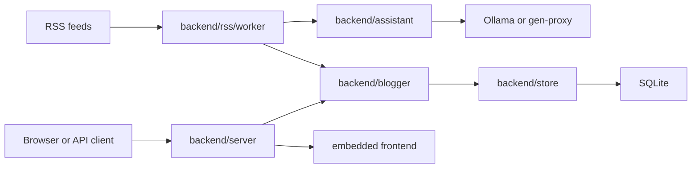

# Architecture

RSS Sum is a single Go process with two main runtime paths:

- an HTTP server for JSON and server-rendered HTML
- a background RSS worker that fetches feeds, summarizes new items, and persists them

`main.go` optionally runs database migrations, then starts both paths with a shared cancellation context. The process exits after receiving `SIGINT` or `SIGTERM`.

## Runtime Flow

1. `main.go` loads the optional `.env` file, then parses top-level settings. See the [configuration contract](../README.md#configuration).
2. If `RUN_MIGRATION=true`, `backend/store` runs GORM auto-migration.
3. When enabled, the HTTP server starts on `HTTP_ADDR`, defaulting to `:8080`.
4. When enabled, the RSS worker runs once immediately, then repeats after `WORKER_INTERVAL_IN_SECONDS`.
5. Shutdown cancels both goroutines and waits for them to finish.

## Core Packages

- `backend/rss/worker` validates configured feed URLs, fetches RSS items with `gofeed`, hashes feed and post identifiers, skips known posts, and retries feed and summary operations.
- `backend/assistant` selects an LLM provider from `LLM_PROVIDER`, builds a summary prompt, requests structured output, and extracts the `summary` field.
- `backend/blogger` is the application service for listing and saving posts. It keeps persistence details out of the worker and server.
- `backend/store` owns SQLite access through GORM. `PostV1` is the stored post model.
- `backend/server` owns routes, middleware, request validation, JSON responses, HTML rendering, and static asset serving.
- `frontend` embeds HTML templates and static assets into the Go binary.

## Boundaries

- Feed safety is enforced before and during HTTP fetches. Only public `http` and `https` feed URLs are accepted.
- LLM provider differences are hidden behind the assistant provider interface.
- Stored post fields are mapped through `backend/blogger`; callers do not write GORM models directly.
- `/api/v1/posts` has one route with two response modes: JSON by default, HTML fragment when `HX-Request: true`.
- Static assets and templates are loaded from the embedded filesystem, not from runtime disk paths.
