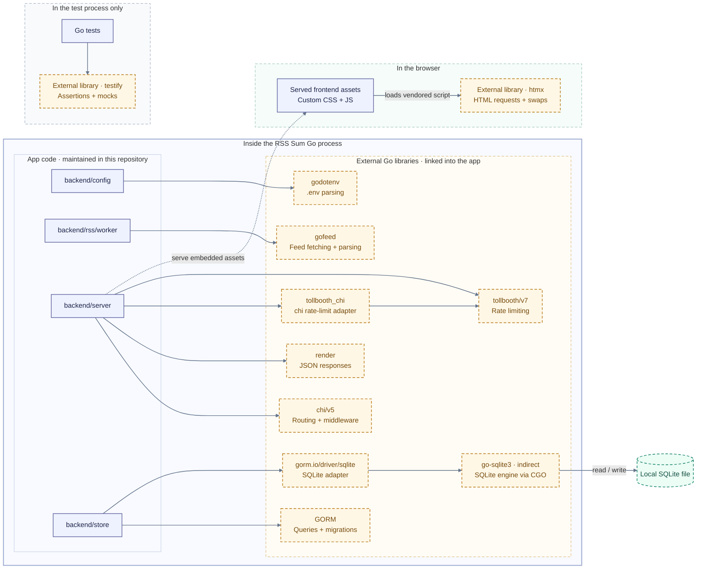

# Architecture

RSS Sum is a single Go process with two main runtime paths:

- an HTTP server for JSON and server-rendered HTML
- a background RSS worker that fetches feeds, summarizes new items, and persists them

`main.go` optionally runs database migrations, then starts both paths with a shared cancellation context. The process exits after receiving `SIGINT` or `SIGTERM`.

The [runtime diagram in the README](../README.md#how-it-works) shows package interactions and the process boundary. The dependency diagram below shows which third-party components each package uses.

## Runtime flow

1. `main.go` loads the optional `.env` file, then parses top-level settings. See the [configuration contract](../README.md#configuration).
2. If `RUN_MIGRATION=true`, `backend/store` runs GORM auto-migration.
3. When enabled, the HTTP server starts on `HTTP_ADDR`, defaulting to `:8080`.
4. When enabled, the RSS worker runs once immediately, then repeats after `WORKER_INTERVAL_IN_SECONDS`.
5. Shutdown cancels both runtime paths and their HTTP request contexts. The server drains requests, closes remaining connections if the drain times out, and waits for handlers before releasing its database. Shutdown failures reach the process owner.

## Core packages

- `backend/config` loads the optional `.env` file and parses environment settings for startup and package configuration.
- `backend/rss/worker` validates configured feed URLs, fetches RSS items with `gofeed`, hashes feed and post identifiers, skips known posts, and retries feed and summary operations.
- `backend/hasher` derives feed and post identifiers with the Go standard library's SHA-256 implementation.
- `backend/assistant` builds a summary prompt, requests structured output from gen-proxy, and extracts the `summary` field.
- `backend/blogger` is the application service for listing and saving posts. It keeps persistence details out of the worker and server.
- `backend/store` owns SQLite access through GORM. `PostV1` is the stored post model.
- `backend/server` owns routes, middleware, request validation, JSON responses, HTML rendering, and static asset serving.
- `frontend` embeds HTML templates and static assets into the Go binary.

## External dependencies

Solid purple boxes show app code; dashed amber boxes identify external libraries. External describes code ownership, not deployment. Go libraries and the SQLite engine execute inside the Go process. The database is a local file. The frontend package embeds htmx in the binary; the server delivers it to the browser, where it executes.

The table covers every direct Go dependency in [go.mod](../go.mod), the SQLite implementation pulled in by its driver, and the vendored frontend library. [go.mod](../go.mod) also lists indirect modules, and [go.sum](../go.sum) records module checksums.

| Dependency | Used by | Purpose | Runs in |
| --- | --- | --- | --- |
| `github.com/joho/godotenv` | `backend/config` | Parses the optional `.env` file. | Go process |
| `github.com/mmcdole/gofeed` | `backend/rss/worker` | Fetches and parses feeds through the app's destination-validating HTTP transport. | Go process |
| `github.com/go-chi/chi/v5` | `backend/server` | Routes HTTP requests and provides throttling and timeout middleware. | Go process |
| `github.com/go-chi/render` | `backend/server` | Writes JSON responses and HTTP status codes. | Go process |
| `github.com/didip/tollbooth/v7` | `backend/server` | Limits HTTP request rates. | Go process |
| `github.com/didip/tollbooth_chi` | `backend/server` | Connects the rate limiter to chi middleware. | Go process |
| `gorm.io/gorm` | `backend/store` | Maps post models to queries, transactions, and migrations. | Go process |
| `gorm.io/driver/sqlite` | `backend/store` | Connects GORM to SQLite. | Go process |
| `github.com/mattn/go-sqlite3`, indirect | SQLite driver | Provides the SQLite engine and Go bindings through CGO. | Go process |
| htmx, vendored | `frontend/static/htmx.min.js` | Requests HTML fragments and swaps them into the article list. | Browser |
| `github.com/stretchr/testify` | Go tests | Provides assertions and mocks. | Test process only |

The assistant uses `net/http` and `encoding/json` from the Go standard library to call gen-proxy. It does not require an SDK. Templates, asset embedding, hashing, and cancellation also use the standard library. The frontend uses custom CSS and JavaScript alongside htmx; it has no frontend build step.

## Feed to summary to reader

1. The worker fetches each configured public feed, using item content or its description as the source text.
2. It derives feed and post identifiers, reads recent stored IDs through blogger, and filters duplicate items.
3. The assistant sends each new item's text to the configured LLM service. See the [provider output contract](../README.md#run-locally).
4. The worker replaces the item's text with its summary and saves successful summaries through blogger and store. Failed summaries are not saved.
5. The browser loads the embedded page and assets, then requests posts. The reading view uses htmx; Wall digest requests the same HTML fragments directly. The server reads stored posts through blogger and store. API clients receive JSON from the same route. See the [API contract](../README.md#api) and [Wall digest behavior](../README.md#wall-digest).

## Boundaries

- Feed safety is enforced before and during HTTP fetches. Only public `http` and `https` feed URLs are accepted.
- Gen-proxy owns inference-provider integration. RSS Sum calls its Responses API through `backend/assistant`.
- Stored post fields are mapped through `backend/blogger`; callers do not write GORM models directly.
- `/api/v1/posts` has one route with two response modes: JSON by default, HTML fragment when `HX-Request: true`.
- Static assets and templates are loaded from the embedded filesystem, not from runtime disk paths.

## Installed local stack

The installer and launcher in `scripts/setup/local_stack.py` own setup and local process supervision. They remain outside the application packages. Release archives contain RSS Sum and its setup scripts. The installer obtains pinned gen-proxy and llama-runtime dependencies after user consent. See [local setup](setup.md) for download verification, configuration, TLS trust, and cleanup.

The launcher starts a generation gRPC backend, a prompt-reduction gRPC backend, gen-proxy, then RSS Sum. Gen-proxy calls the backends over HTTPS gRPC; RSS Sum uses the existing gen-proxy Responses API over loopback HTTP. Feed validation, summary parsing, and SQLite ownership remain in their existing Go packages. The launcher owns its child processes directly and holds an installation lock for their lifetime. Shutdown and startup failures stop those children before releasing the lock.
